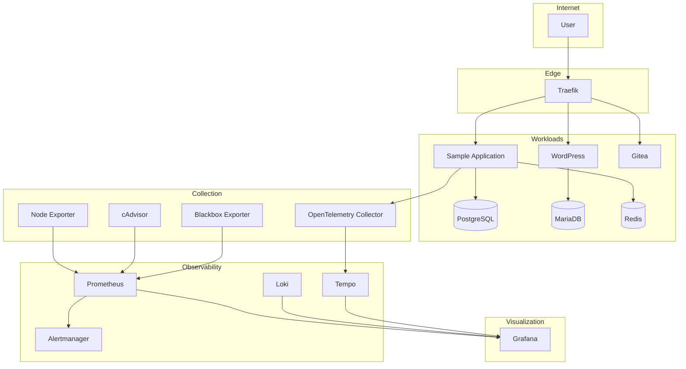

# Architecture Diagram

## Overview

This document provides a high-level view of the Production Observability Platform.

The architecture is organized into four logical layers:

1. Workloads
2. Telemetry Collection
3. Observability Platform
4. Visualization

The goal is to maintain clear separation of responsibilities while enabling end-to-end observability.

---

## High-Level Architecture

---

## Architecture Layers

### Edge Layer

Handles incoming traffic and routes requests to internal services.

Current component:

* Traefik

---

### Workload Layer

Represents the applications and databases that generate operational telemetry.

These services are the primary observation targets.

---

### Telemetry Collection Layer

Collects infrastructure and application telemetry.

Responsibilities include:

* Metrics collection
* Infrastructure monitoring
* Trace collection
* Service availability checks

---

### Observability Platform Layer

Stores and processes telemetry.

Each service has a dedicated responsibility:

* Prometheus → Metrics
* Loki → Logs
* Tempo → Traces
* Alertmanager → Alerts

---

### Visualization Layer

Grafana provides a unified operational interface.

Operators should be able to move seamlessly between metrics, logs, traces, and alerts.

---

## Design Goals

The architecture prioritizes:

* Modularity
* Scalability
* Replaceable components
* Open standards
* Operational simplicity
* Loose coupling

---

## Related Documents

- [System Overview](SYSTEM_OVERVIEW.md)
- [Components](COMPONENTS.md)
- [Data Flow](DATA_FLOW.md)
- [ADR-001](../adr/ADR-001-platform-architecture.md)
